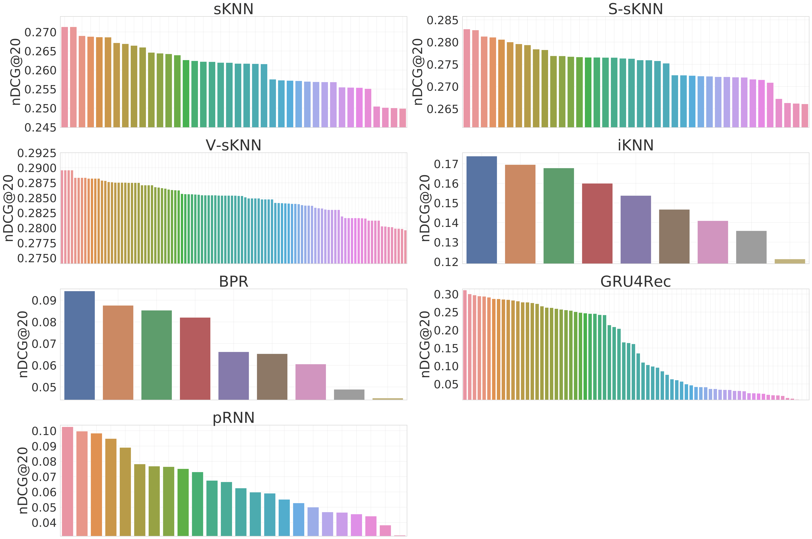
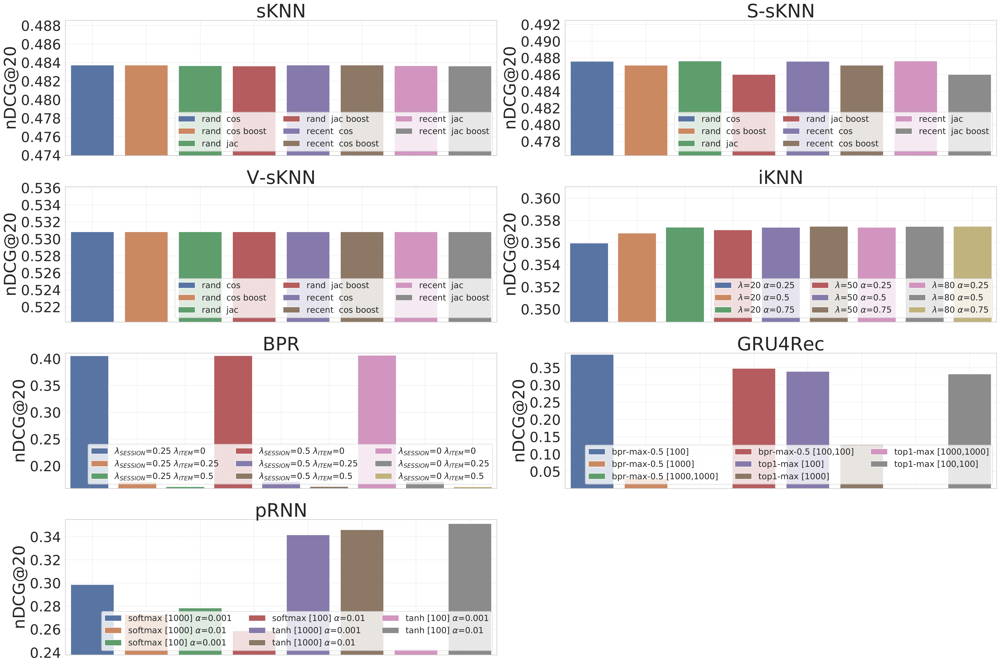
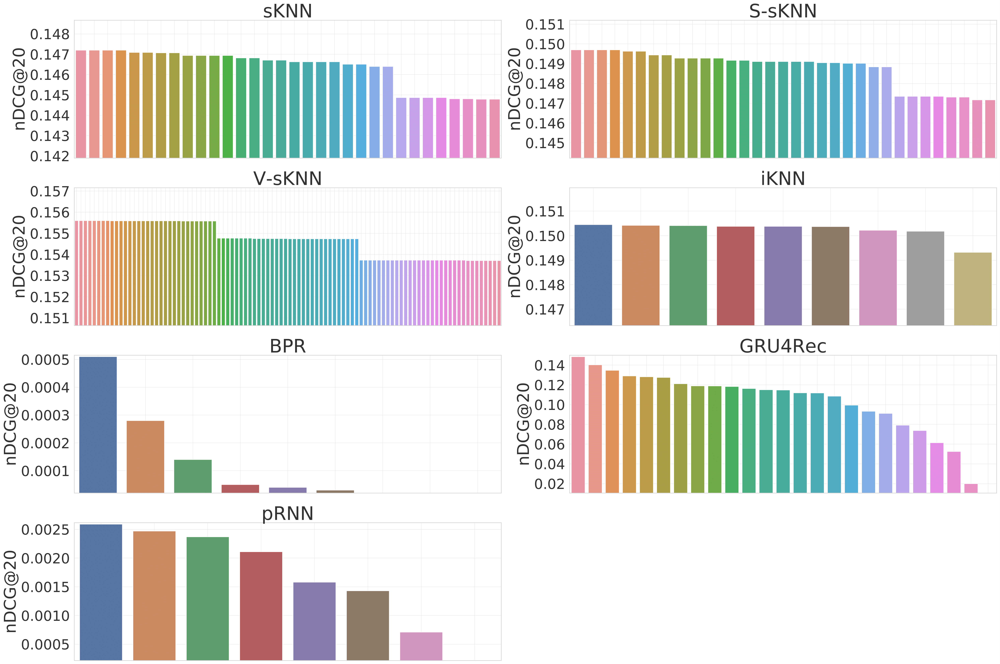

# Hyperparameter optimization

Hyperparameters are optimized for each dataset by evaluating the **nDCG** metric using the **validation test set**. 

| **Approach** | **Parameter**            | **Studo**         | **RecSys17**         | **CareerBuilder12** |
|--------------|--------------------------|-------------------|----------------------|---------------------|
| BPR          | λ SESSION                | 0.25              | 0                    | 0                   |
| BPR          | λ ITEM                   | 0.25              | 0                    | 0                   |
| iKNN         | λ                        | 80                | 50                   | 20                  |
| iKNN         | α                        | 0.75              | 0.75                 | 0.75                |
| sKNN         | k                        | 100               | 500                  | 1000                |
| sKNN         | SAMPLING                 | recent            | random               | random              |
| sKNN         | SIMILARITY               | cosine            | cosine               | jaccard             |
| sKNN         | POPULARITY BOOST         | no                | no                   | yes                 |
| S-sKNN       | k                        | 100               | 500                  | 1000                |
| S-sKNN       | SAMPLING                 | recent            | random               | random              |
| S-sKNN       | SIMILARITY               | cosine            | jaccard              | cosine              |
| S-sKNN       | POPULARITY BOOST         | no                | no                   | yes                 |
| V-sKNN       | k                        | 100               | 100                  | 100                 |
| V-sKNN       | SAMPLING                 | recent            | random               | random              |
| V-sKNN       | SIMILARITY               | cosine            | cosine               | cosine              |
| V-sKNN       | POPULARITY BOOST         | no                | no                   | no                  |
| V-sKNN       | WEIGHTING                | Quadratic         | Quadratic            | Logarithmic         |
| GRU4Rec      | LOSS                     | top1-max          | bpr-max-0.5          | top1-max            |
| GRU4Rec      | LAYERS                   | \[100\]           | \[100\]              | \[1000\]            |
| GRU4Rec      | DROPOUT                  | 0.2               | 0.2                  | 0.2                 |
| GRU4Rec      | BATCH SIZE               | 32                | 32                   | 32                  |
| pRNN         | ACTIVATION               | tanh              | tanh                 | softmax             |
| pRNN         | LAYERS                   | \[1000\]          | \[100\]              | \[1000\]            |
| pRNN         | α                        | 0.001             | 0.01                 | 0.001               |
| pRNN         | BATCH SIZE               | 512               | 512                  | 512                 |

## Studo

## RecSys17

## CareerBuilder12
